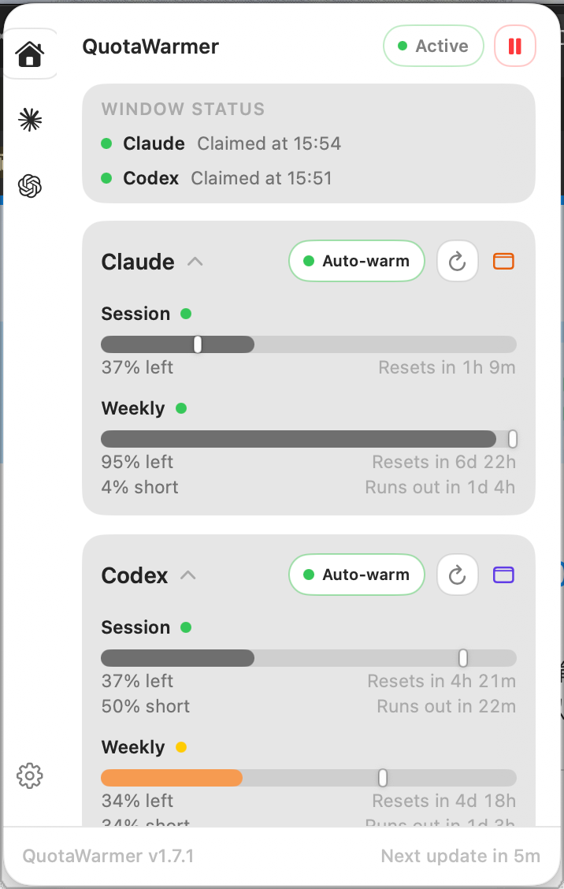
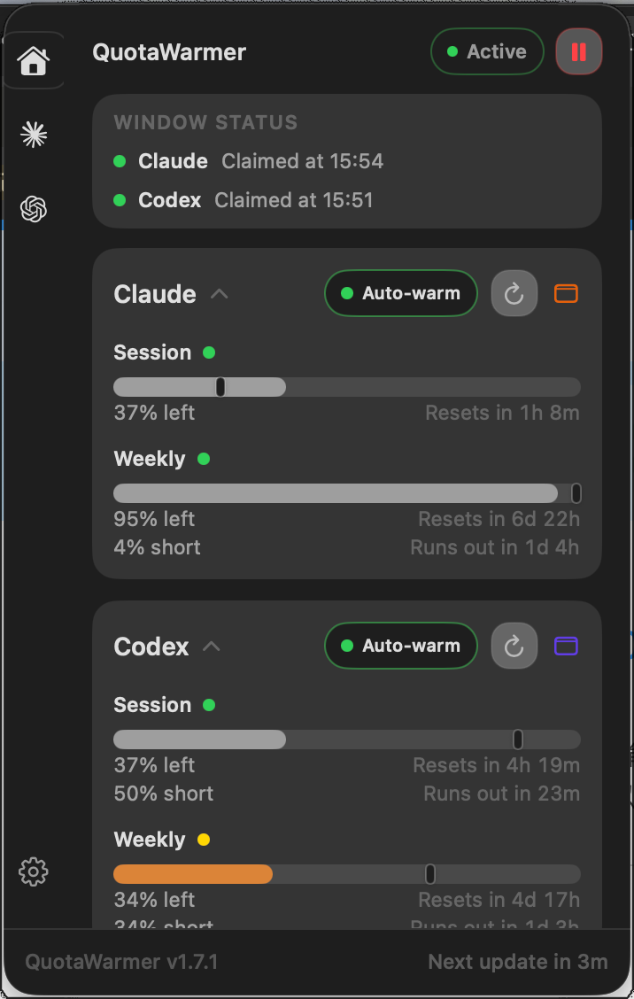
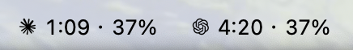

# QuotaWarmer

**English** | [简体中文](README.zh-CN.md)

A compact macOS menu bar app that keeps your Claude Code and Codex CLI quota windows warm — it watches your rolling 5-hour windows and, when you ask it to, claims a fresh one the moment it opens instead of waiting for you to remember.

<p align="center">
  
  
</p>
<p align="center">
  
</p>

By default it only **monitors**: it watches live quota snapshots and shows each provider's window in the menu bar. Switch a tool to **Auto-warm** and it also sends a minimal warm-up command through your own logged-in CLI the instant a fresh window opens, then verifies the window actually started.

## This Repository

This is a personal fork of [bcanozgur/quota-warmer](https://github.com/bcanozgur/quota-warmer), kept because the upstream project's only tagged release carried a credential bug (see [Credits](#credits)) and I needed a build without it for my own daily setup — a Mac that wakes at 7am, warms both tools, and keeps re-claiming windows through the day with no input from me. On top of that starting point I redesigned the panel to follow the system's own light/dark palette instead of a fixed hex one, fixed the recurring Keychain approval prompt, and made auto-warm resilient to the quota-check API being rate-limited (which, it turns out, happens for hours at a stretch and used to stall the whole thing).

## Highlights

- **Three modes per tool**: **Off**, **Monitor only** (watch quota, never send anything — the default), or **Auto-warm** (claim fresh windows automatically).
- **Menu bar status at a glance**: provider glyph, a clock-style countdown, and remaining quota percentage — quiet when healthy, a colored badge only when something needs attention.
- **Claude Code and Codex CLI support**: each provider is monitored, refreshed, and warmed independently.
- **Resilient auto-warm**: if the live quota check is unavailable, auto-warm falls back to real local CLI activity on disk to decide whether a window needs claiming — a rate-limited status API no longer stalls the thing this app exists to do.
- **Window claim receipt**: after a warm-up, QuotaWarmer re-checks quota to confirm the window actually opened, so "sent" never quietly means "missed."
- **Liveness watchdog**: if the app ever stops checking quota, the menu bar and popover say so instead of looking healthy.
- **Manual controls**: refresh quota or warm a provider directly from the popover.
- **Lightweight history**: recent quota checks, warm-ups, claim confirmations, and failures are visible without leaving the menu.
- **Morning pre-warm**: schedules the Mac to wake at a set time and claims the day's first window automatically, lid closed or not.
- **Launch at login**: runs quietly as a menu bar utility, no Dock icon.

## Is This Allowed?

QuotaWarmer uses capacity you already pay for, through the official CLI you're already signed into. It never bypasses or raises your limits, never shares or uploads your credentials, and sends nothing at all for tools left on Monitor or Off. Providers may change their APIs at any time; if automated warm-up is ever disallowed, set a tool to Monitor and QuotaWarmer keeps tracking your quota.

## How It Works

Claude Code and Codex CLI use rolling quota windows. If a window starts only when you remember to open the CLI, part of the available time goes to waste.

QuotaWarmer runs quietly in the menu bar and periodically checks quota state for monitored providers. For a tool set to Auto-warm, when a fresh window is detected — either from a live quota reading, or, if that check is unavailable, from the absence of any recent local CLI activity — it runs a minimal warm-up command from an isolated temporary working directory:

```bash
claude --model haiku --effort low --no-session-persistence -p 'hi'
codex exec --model gpt-5.4-mini -c model_reasoning_effort="low" --skip-git-repo-check --ephemeral --ignore-rules 'hi'
```

Local activity is read from:

```text
~/.claude/projects/*/*.jsonl
~/.codex/sessions/YYYY/MM/DD/*.jsonl
```

These logs both give the UI display context and, since they reflect real usage rather than a network call, back up the auto-warm decision when the live API can't.


## Requirements

| Dependency | Requirement |
| --- | --- |
| macOS | 14.0 Sonoma or later |
| Xcode | 16+ (local builds only — see below) |
| Claude Code | Installed and available on your shell `PATH` |
| Codex CLI | Installed and available on your shell `PATH` |

## Install

### Download a release

1. Download the latest `QuotaWarmer-<version>-universal.dmg` from this repo's [Releases](https://github.com/WenjunLi2004/quota-warmer/releases).
2. Open the DMG and drag **QuotaWarmer.app** to **Applications**.
3. Clear the Gatekeeper quarantine (the DMG is ad-hoc signed but not Apple-notarized):
   ```bash
   xattr -dr com.apple.quarantine "/Applications/QuotaWarmer.app"
   ```
   …or right-click **QuotaWarmer.app** and choose **Open** the first time.
4. Launch it from Applications.

### Build from source

SwiftUI's `@State` compiles through a macro plugin that only ships with full Xcode, so this needs Xcode installed — Command Line Tools alone won't build it.

```bash
brew install xcodegen
git clone https://github.com/WenjunLi2004/quota-warmer.git
cd quota-warmer
xcodegen generate
open QuotaWarmer.xcodeproj
```

Or headless:

```bash
xcodebuild -project QuotaWarmer.xcodeproj -scheme QuotaWarmer build
```

### Verifying a release

Every DMG here is built by this repo's own `release-unsigned.yml`, on GitHub's macOS runners, from the exact tagged commit — never assembled by hand. To check a given release traces back to a specific, readable commit: compare that tag's `project.yml` against [upstream `main`](https://github.com/bcanozgur/quota-warmer/compare/main...WenjunLi2004:quota-warmer:main) (the only difference should be the version string), and check the downloaded DMG's SHA-256 against the `.sha256` file published in the same release.

## Two Trade-offs Worth Knowing About

**The quota percentage can occasionally ask for Keychain access.** Reading Claude Code's own stored credential is the only way to get a live percentage, and macOS's "Always Allow" grant on that item does not survive Claude Code rewriting it on each OAuth token rotation (roughly every 8 hours) — so the approval dialog can reappear on that same cadence. QuotaWarmer mirrors the token into its own Keychain item between rotations specifically to cut down how often this happens, but it can't eliminate it entirely. If the prompt bothers you more than the live percentage is worth, set that tool to **Monitor** or **Off** — auto-warm itself runs the CLI directly and doesn't need this at all.

**A long-lived token from `claude setup-token` will not work here.** It was tried, on the theory that an app-owned Keychain item never needs re-approval — true, but Anthropic's usage-check endpoint (`/api/oauth/usage`) rejects that token type outright, with a 429 that's indistinguishable from ordinary rate-limiting. It looks exactly like the endpoint being overloaded; it's really just the wrong kind of credential, and no amount of waiting fixes it. If the quota percentage is stuck showing nothing for more than a few refresh cycles with no rate-limit message clearing on its own, this is the first thing to check — the fix is reading Claude Code's normal OAuth credential instead, not a longer wait.

Separately: if the live quota check does go down for a genuine, temporary reason (network blip, a real transient rate limit), auto-warm doesn't wait for it to recover — it falls back to local CLI activity on disk to decide whether a window still needs claiming (see [How It Works](#how-it-works)), so a percentage outage alone doesn't stall the thing this app exists to do.

## Project Structure

```text
Sources/QuotaWarmer/
  Models/       Shared app and quota types
  Services/     Quota checks, scheduling, notifications, updates, warm-up commands
  Views/        SwiftUI menu bar label, popover, provider, and settings screens
  Assets.xcassets/
project.yml     XcodeGen project definition
scripts/        Local install and packaging helpers
```

## Credits

This project is a fork of [bcanozgur/quota-warmer](https://github.com/bcanozgur/quota-warmer) — all of the core design (the menu bar concept, the quota dashboard, the warm-up mechanism) is the original author's work. This fork exists because upstream's only tagged release (`v1.0.0`) includes a Claude OAuth refresh-token exchange that spends the CLI's single-use rotating refresh token without persisting the replacement, which can silently invalidate Claude Code's own stored credential — `main` had already removed that logic by the time this fork was cut, but no new release had shipped it, and building locally wasn't possible without full Xcode (see above). Everything past that starting commit — the panel redesign, the Keychain-prompt fix, and the resilient auto-warm fallback — was written for this fork; none of it should be read as a comment on the quality of the upstream project, which remains the place to go for the actively maintained original.

## License

MIT
